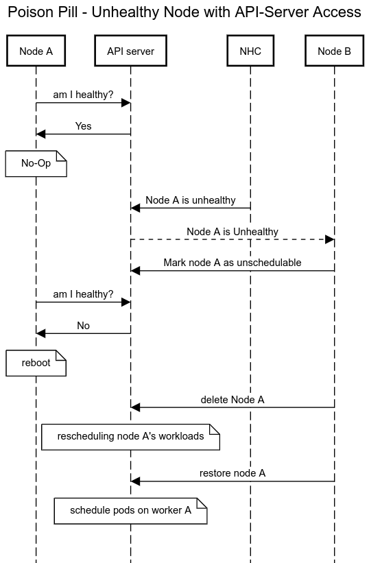
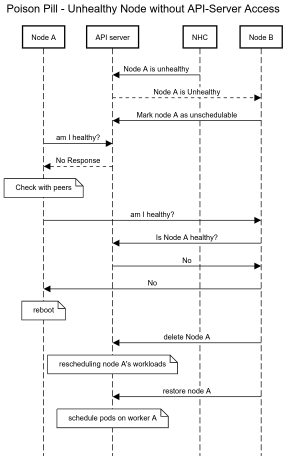
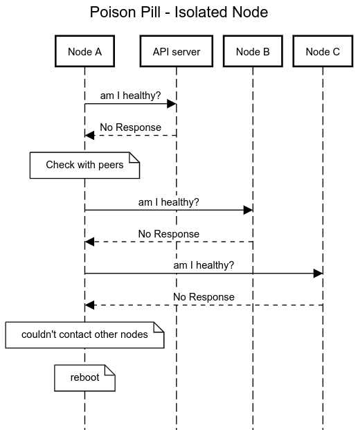
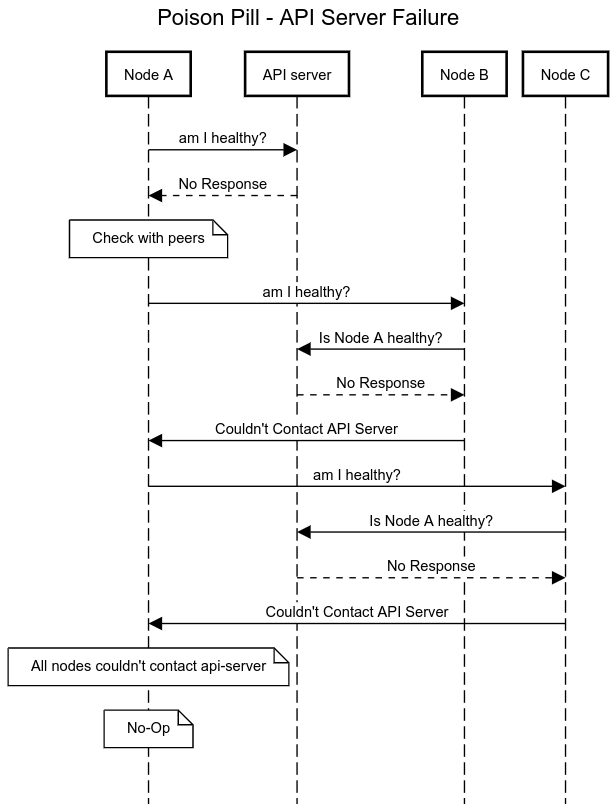

# Node Remediation with Poison Pill
{: .no_toc }

## Table of contents
{: .no_toc .text-delta }

1. TOC
{:toc}

Poison Pill is an open-source remediation system that runs as a Daemonset - a pod per node, which reboots unhealthy nodes.
Node Healthceck Operator (or any other operator that supports the external remediation API) will create 
a PoisonPillRemediation CR for an unhealthy node. The Poison Pill agent will reboot once this CR exists.

As opposed to other remediation systems, Poison Pill does not require any management interface (e.g. IPMI etc.)

## How Poison Pill is Different from Other Solutions?
The existing remediation solutions have some limitations, assumptions or pre-requisites that do not apply to Poison Pill:

* The unhealthy node should be able to contact the API-Server
* The cluster should have been provisioned with some way to interact with the infrastrcture provider (such as Cluster-API Machines)
* The control plane should have connectivity to the unhealthy node's management interface

Poison Pill doesn't have any of this limitations and has no pre-requisites

## How Poison Pill Works?

Poison Pill is a consumer of the external remediation API. It was tested with Node Healthcheck Operator which creates a PoisonPillRemediation CR once a node turns unhealthy.
Poison Pill reboots unheatlhy nodes, and the other healthy nodes are cordoning it, and letting the cluster know it can reschedule the workload elsewhere.
There are four main cases.

### A Node with API-Server Access
When node has api-server access it can easily detect if NHC declared it as healthy or not:

### A Node without API-Server Access
When a node loses api-server access it can't check if it's healthy or not (i.e. to check if PoisonPillRemediation CR exists for it).
The node will ask its peers if they can access the api-server on behalfo of it, to check if it's healthy.

### An Isolated Node 
A node might lose any connectivity to other entities. In this case, the node can't detect if it's healthy or not.
Since the other healthy nodes would like to fence the node, and let the scheduler move the workloads to other nodes, they need to delete the node object from the cluster.
This must be done only when the unhealthy node is no longer running any workloads, otherwise it would be a violation of the run-once semantics of some applications.
They healthy nodes will assume the unhealthy node has been rebooted after some safe, finite timeout that the unhealthy node was expected to ask all other nodes, fail, and reboot.

### An API-server failure
If there's an api-server failure, which means that all nodes can't access the api-server, we don't want to reboot.
It would create an uncessary reboot storm in the cluster.

## How Poison Pill Reboots a Node?
We encourage users to utilize a watchdog device, which will be able to reboot the node even in the case of resource starvation or bugs that may exist.
In nodes without a hardware wathcdog device, softdog is prefered.
In the absence of a valid watchdog device, poison pill will use forced software reboot.

## Why does Poison Pill contact other nodes?
In the case of issues which prevent getting responses from the api-server, there’s no way for the poison-pill agent to know if it’s healthy or not.
If we would have ignored this situation, the other nodes could assume the unhealthy node has been rebooted and delete the node while it’s still running.
To overcome this, the node queries the other nodes and uses them as a proxy to the api-server, so they can tell if it’s healthy or not.
If the other nodes can’t access the api-server as-well, we assume this is an api-server failure and do no nothing.

## What actions are taken by the healthy nodes once there’s an unhealthy node?
The nodes will mark the unhealthy node as unschedulable, backup the node resource in the PPR (PoisonPillRemediation) so we can restore the node later, and delete the node object which signals to the cluster that the workloads can be safely rescheduled elsewhere.

## Why does Poison Pill restore the node? Why are we not doing it in power-based remediation?
In power based remediation we delete the node once the host is powered off. Once the host is powered on again, it would register itself in the cluster.
In Poison Pill, we can’t keep the host powered off (we don’t have BMC credentials/access), so the node is deleted when the unhealthy node is powered-on. Kubelet will only register itself when it boots. So once the node is deleted, it will never come back unless we restore it.
the flow is:
1. node x becomes unhealthy
2. node x reboots
3. node x boots, the node object already exists in the cluster (nothing deleted it at this point)
4. other node deletes the unhealthy node

## What are the Poison Pill CRDs and what’s their purpose?
Poison Pill has 3 CRDs:
* PoisonPillConfig - automatically created by the operator. Contains configuration for the poison pill daemonset, and can be modified by the user.
* PoisonPillRemediation - the health detection system (e.g. MHC/NHC) should create instance of this CR to signal that a node/machine is unhealthy.
* PoisonPillRemediationTemplate - automatically created by the operator and should be referenced in the MHC/NHC CR. This is currently empty but we might be used to pass some remediation configuration.

## Does Poison Pill work on its own as a standalone operator?
Poison Pill is a remediation/fencing system. It doesn’t provide any health detection system.
Poison pill is a consumer of the external remediation api, and responds to health issues reported by that API.
Note that in the case of a node that can’t contact any of the nodes, the poison pill will trigger remediation without relying on any health detection system.

## Known Issues
Poison Pill has several known issues:
1. Currently only one health detection system (e.g. NHC, MHC) is supported at the same time (i.e. you can't use NHC and MHC at the same time)
2. The timeout to assume the node has been rebooted is the same for all nodes. The safe timeout should be configured for the highest watchdog timeout
3. Poison Pill does not run on masters
4. operator uninstall doesn't remove the poison pill daemonset. a user should delete the PoisonPillConfig CR to remove the daemonset.
5. Upon poison pill installation, it might take up to 2 minutes before the daemonset is deployed
6. IPv6 is not supported
7. Clusters with OVN network plugin are not supported due to [Bug 1973286](https://bugzilla.redhat.com/show_bug.cgi?id=1973286)
8. At least two workers are required to get node fencing

## Source Code
Poison Pill is open source: [Github Repo](https://github.com/medik8s/poison-pill)

