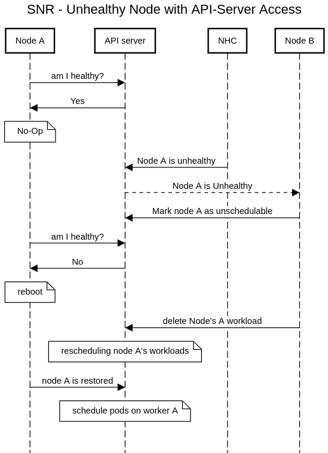
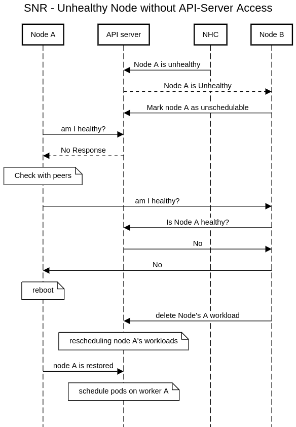
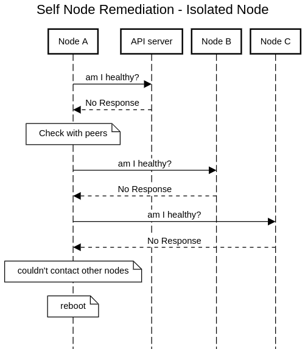
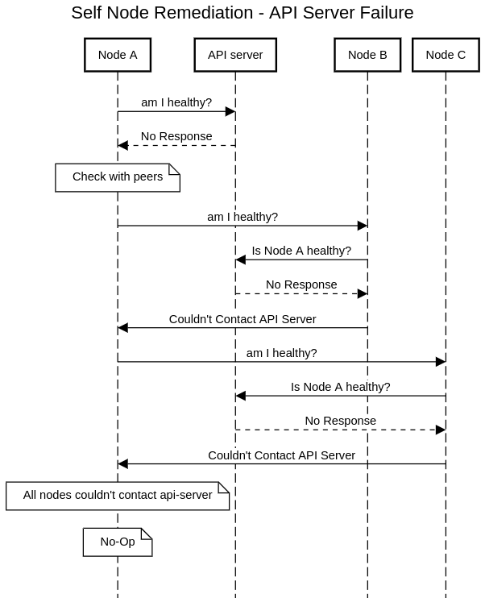

# How Self Node Remediation Works?

Self Node Remediation is a consumer of the external remediation API. It was tested with Node Healthcheck Operator (NHC) which creates a SelfNodeRemediation CR once a node turns unhealthy.
Self Node Remediation reboots unhealthy nodes, and the other healthy nodes are cordoning it, and letting the cluster know it can reschedule the workload elsewhere.
There are four main cases:

## A Node with API-Server Access
When a node has api-server access it can easily detect if NHC declared it as healthy or not:

## A Node without API-Server Access
When a node loses api-server access it can't check if it's healthy or not (i.e. to check if SelfNodeRemediation CR exists for it).
The node will ask its peers if they can access the api-server on behalf of it, to check if it's healthy.

## An Isolated Node 
A node might lose any connectivity to other entities. In this case, the node can't detect if it's healthy or not.
Since the other healthy nodes would like to fence the node, and let the scheduler move the workloads to other nodes, they need to delete the node object from the cluster.
This must be done only when the unhealthy node is no longer running any workloads, otherwise it would be a violation of the run-once semantics of some applications.
The healthy nodes will assume the unhealthy node has been rebooted after some safe finite timeout that the unhealthy node was expected to ask all other nodes, fail, and reboot.

## An API-server failure
If there's an api-server failure, which means that all nodes can't access the api-server, we don't want to reboot.
It would create an unnecessary reboot storm in the cluster.

